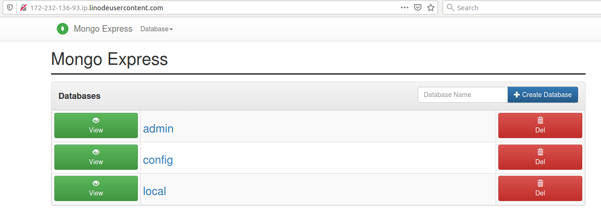

This README provides step-by-step instructions for deploying a Kubernetes cluster on Linode Kubernetes Engine (LKE) and installing MongoDB, Mongo Express, and an NGINX Ingress Controller to access Mongo Express via a domain or IP in a browser.

# Prerequisites

Ensure you have the following installed:
• A Linode account 
• kubectl 
• helm 

# Step 1: Create a Kubernetes Cluster on Linode

1. Log in to your Linode account and navigate to Kubernetes.
2. Click “Create Cluster” and configure:
• Choose a Region (e.g., Newark, Frankfurt)
• Select a Kubernetes Version
• Add Node Pools (e.g., 2 nodes, 2 vCPUs, 4GB RAM each)
• Click “Create Cluster”

# Step 2: Configure kubectl for Linode LKE

1. Download the kubeconfig file

2. Export the kubeconfig:

export KUBECONFIG=kubeconfig.yaml

3. Verify connection to the cluster:

kubectl get nodes

# Step 3: Install Helm

If Helm is not installed, install it using:

curl https://raw.githubusercontent.com/helm/helm/main/scripts/get-helm-3 | bash

Verify the installation:

helm version

# Step 4: Deploy an NGINX Ingress Controller

1. Install the Ingress Controller using Helm

helm repo add ingress-nginx https://kubernetes.github.io/ingress-nginx

helm install nginx-ingress ingress-nginx/ingress-nginx

2. Verify the Ingress Controller Installation

kubectl get svc 

Find the EXTERNAL-IP of the nginx-ingress-controller service.

# Step 5: Deploy MongoDB with Helm

1. Add the Bitnami Helm Repository

helm repo add bitnami https://charts.bitnami.com/bitnami

2. Install MongoDB Using Helm

helm install mongodb --values helm-mongodb.yaml bitnami/mongodb

This will deploy a MongoDB instance with the values specified in the helm-mongodb.yaml file

# Step 6: Deploy Mongo Express yaml file

kubectl apply -f mongo-express.yaml

# Step 7: Configure Ingress for Mongo Express and Apply the Ingress Resource

kubectl apply -f mongo-express-ingress.yaml

Verify the Ingress Controller is Working

kubectl get ingress

It should display an entry with mongoexpress.yourdomain.com.

# Step 8: Access Mongo Express in Browser

• Log in with:
• Username: admin
• Password: pass

# Step 9: Various commands for Managing Helm and Kubernetes Resources

### List all Helm Releases

helm list

### Upgrade MongoDB Release

helm upgrade my-mongodb bitnami/mongodb

### Rollback a Helm Release

helm rollback my-mongodb 1

### Uninstall MongoDB

helm uninstall my-mongodb

### Uninstall Mongo Express

kubectl delete -f mongo-express.yaml

### Uninstall the Ingress Controller

helm uninstall nginx-ingress

# Step 10: Clean Up the Cluster

When finished, delete the Linode Kubernetes cluster to avoid extra charges.

